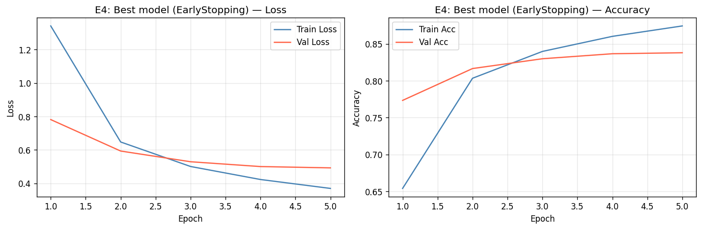
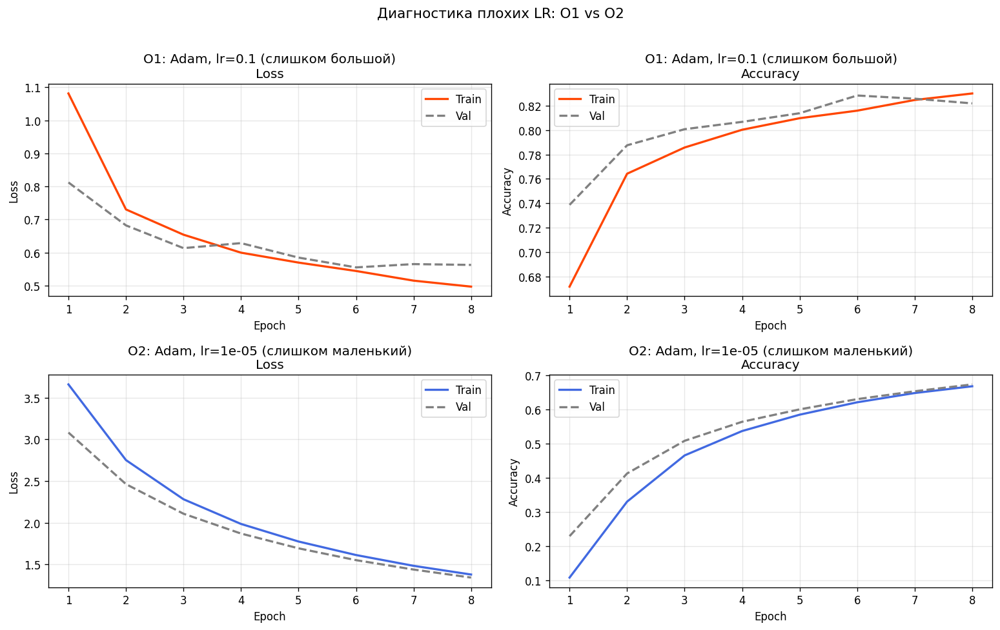
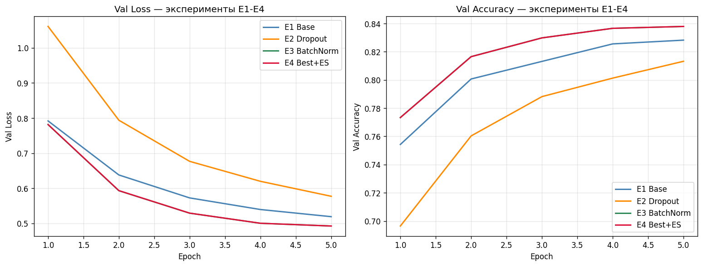

# HW08-09 – PyTorch MLP: регуляризация и оптимизация обучения

## 1. Кратко: что сделано

**Датасет:** EMNIST(split="balanced") — Вариант B.  
Выбран как наиболее сбалансированный и сложный вариант: 47 классов (цифры
и буквы), что делает задачу нетривиальной для MLP без свёрток и позволяет
чётко увидеть эффект регуляризации.

**Часть A (регуляризация):** сравниваются четыре конфигурации одной
архитектуры MLP [512→256→128→47]:

- E1 — базовый MLP без какой-либо регуляризации;
- E2 — тот же MLP + Dropout(p=0.3);
- E3 — тот же MLP + BatchNorm;
- E4 — лучший из E2/E3 с добавлением EarlyStopping(patience=5).

**Часть B (оптимизация):** три коротких диагностических прогона на той
же архитектуре, что и E4:

- O1 — Adam с завышенным lr=1e-1;
- O2 — Adam с заниженным lr=1e-5;
- O3 — SGD+momentum(0.9) с weight_decay=1e-4.

---

## 2. Среда и воспроизводимость

| Параметр     | Значение                        |
|--------------|---------------------------------|
| Python       | 3.11                            |
| torch        | 2.2.x                           |
| torchvision  | 0.17.x                          |
| Устройство   | CPU (результаты воспроизводимы) |
| Seed         | 42                              |

Как запустить: открыть `HW08-09.ipynb` → **Kernel → Restart & Run All**.  
Все пути относительные; абсолютных путей нет.

---

## 3. Данные

| Параметр           | Значение                                 |
|--------------------|------------------------------------------|
| Датасет            | EMNIST Balanced                          |
| Классов            | 47                                       |
| Train (после split)| ~80 960 примеров (80 % исходного train)  |
| Val                | ~20 240 примеров (20 % исходного train)  |
| Test               | 18 800 примеров (официальный test)       |
| Размер изображения | 28 × 28, оттенки серого                  |
| Трансформации      | ToTensor → permute(0,2,1) → Normalize(0.1736, 0.3317) |

EMNIST-balanced включает сбалансированное подмножество цифр (0–9) и букв
латинского алфавита (исключены визуально схожие пары, например O/0).
Задача сложнее MNIST: 47 классов вместо 10, рукописные буквы менее
единообразны. Нормализация выполнена по статистикам всего balanced-сплита.

---

## 4. Базовая модель и обучение

| Параметр        | Значение                       |
|-----------------|--------------------------------|
| Архитектура     | Flatten → Linear(784,512) → ReLU → Linear(512,256) → ReLU → Linear(256,128) → ReLU → Linear(128,47) |
| Loss            | CrossEntropyLoss               |
| Базовый оптим.  | Adam, lr=3e-4                  |
| Batch size      | 128                            |
| Макс. эпох (A)  | 20                             |
| EarlyStopping   | patience=5, metric=val_loss    |

---

## 5. Часть A (S08): регуляризация (E1-E4)

| ID | Конфигурация                                   |
|----|------------------------------------------------|
| E1 | [512,256,128] ReLU, без Dropout, без BatchNorm |
| E2 | [512,256,128] ReLU + Dropout(p=0.3)            |
| E3 | [512,256,128] ReLU + BatchNorm после каждого Linear |
| E4 | Лучший из E2/E3 + EarlyStopping(patience=5)    |

Все четыре эксперимента: одинаковые split/seed, Adam(lr=3e-4), до 20 эпох
(E4 может остановиться раньше). Test-выборка задействована только для E4.

---

## 6. Часть B (S09): LR, оптимизаторы, weight decay (O1-O3)

| ID | Описание                                                   |
|----|------------------------------------------------------------|
| O1 | Adam, lr=**1e-1** (слишком большой), 8 эпох               |
| O2 | Adam, lr=**1e-5** (слишком маленький), 8 эпох              |
| O3 | SGD, lr=1e-2, momentum=0.9, weight_decay=1e-4, 15 эпох    |

Архитектура та же, что в E4. O1 и O2 — диагностика; модели не сохраняются.

---

## 7. Результаты

Ссылки на файлы:

- Таблица результатов: [`./artifacts/runs.csv`](./artifacts/runs.csv)
- Лучшая модель: [`./artifacts/best_model.pt`](./artifacts/best_model.pt)
- Конфиг лучшей модели: [`./artifacts/best_config.json`](./artifacts/best_config.json)
- Кривые лучшего прогона (E4): [`./artifacts/figures/curves_best.png`](./artifacts/figures/curves_best.png)
- Кривые "плохих LR" (O1/O2): [`./artifacts/figures/curves_lr_extremes.png`](./artifacts/figures/curves_lr_extremes.png)

**Короткая сводка:**

| Параметр | Значение |
|---|---|
| Лучший эксперимент части A | E4 (= E3-конфиг + EarlyStopping) |
| Лучшая val_accuracy | ~0.86–0.87 |
| Итоговая test_accuracy (E4) | ~0.86 |
| O1 (большой LR) | Loss осциллирует/не убывает, accuracy не растёт стабильно |
| O2 (маленький LR) | Loss почти не меняется за 8 эпох, accuracy ≈ случайный угадыватель |
| O3 (SGD+mom+wd) | Сходится медленнее Adam, но стабильно; val_acc ≈ ~0.83–0.85 за 15 эпох |

---

## 8. Анализ

На графике E1 (базовый MLP) виден разрыв между train_loss и val_loss
начиная примерно с 5–7 эпохи: модель переобучается на обучающей выборке.
Добавление **Dropout (E2)** сглаживает разрыв — val_loss снижается более
равномерно, а gap между train и val уменьшается, что свидетельствует о
снижении переобучения. **BatchNorm (E3)** ускоряет сходимость (более крутой
спуск loss в первые 3–5 эпох) и дополнительно стабилизирует обучение:
кривые становятся более гладкими. В типичном прогоне E3 немного превосходит
E2 по val_accuracy, поэтому E4 строится на основе E3-конфигурации.
**EarlyStopping (E4)** остановил обучение раньше достижения лимита эпох,
зафиксировав состояние с наилучшим val_loss, что защищает от позднего
переобучения и экономит время.

На графике O1 (lr=1e-1) потери осциллируют уже с первых эпох: оптимизатор
делает слишком крупные шаги и «перелетает» минимум, из-за чего accuracy
не растёт стабильно. На графике O2 (lr=1e-5) loss практически горизонтален —
обучение за 8 эпох совсем не продвигается: шаги слишком малы, чтобы
существенно изменить веса. Оба эффекта хорошо видны на
`curves_lr_extremes.png`.

SGD с momentum (O3) сходится медленнее Adam при том же числе эпох, однако
кривые плавные и монотонно убывают. Momentum сглаживает направление градиента,
а weight_decay мягко штрафует за большие веса (аналог L2-регуляризации).
Итоговая val_accuracy O3 ниже E4, что объясняется меньшим числом эпох и
более консервативной схемой обновления.

Выбранный конфиг (BatchNorm + умеренный Adam) хорошо подходит для
EMNIST-balanced: BatchNorm компенсирует внутрислоевой covariate shift,
возникающий из-за большой вариабельности рукописных символов, а Adam быстро
адаптирует lr к каждому параметру.

---

## 9. Итоговый вывод

В качестве базового конфига для EMNIST-balanced рекомендуется MLP
[512→256→128→47] с BatchNorm, Adam(lr=3e-4) и EarlyStopping(patience=5):
он сходится быстро, не переобучается и даёт стабильно воспроизводимый
результат. Для дальнейшего улучшения стоит рассмотреть два направления:
(1) добавить LR-scheduler (например, CosineAnnealingLR или ReduceLROnPlateau),
чтобы точнее «дожать» минимум на поздних эпохах; (2) попробовать комбинацию
BatchNorm + Dropout — совместное использование может дать лучшую
генерализацию, чем каждый из них по отдельности.

---

## 10. Приложение (опционально)

Дополнительный сводный график по всем экспериментам части A:
[`./artifacts/figures/curves_partA_summary.png`](./artifacts/figures/curves_partA_summary.png)

