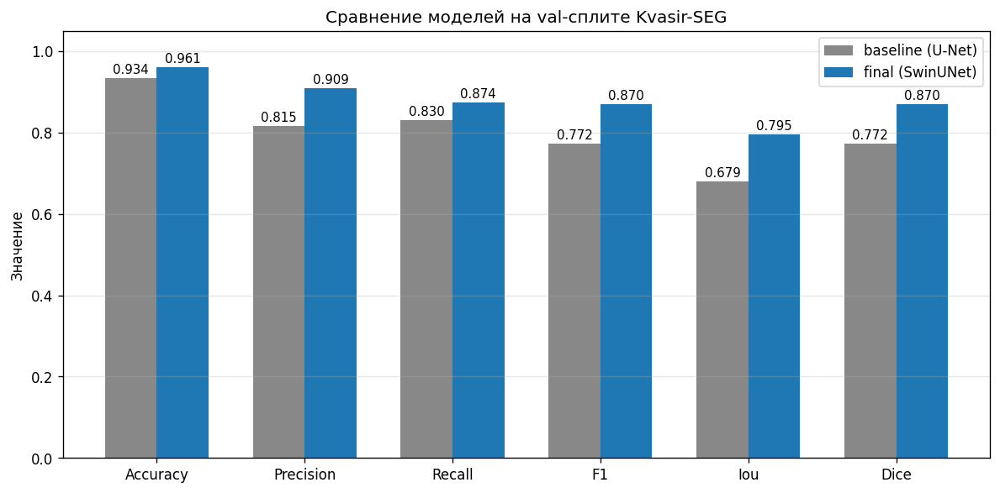
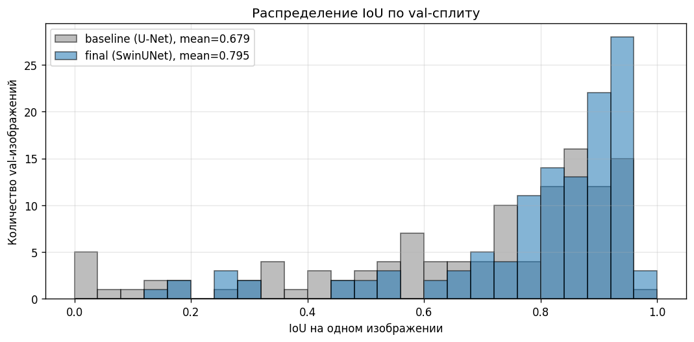
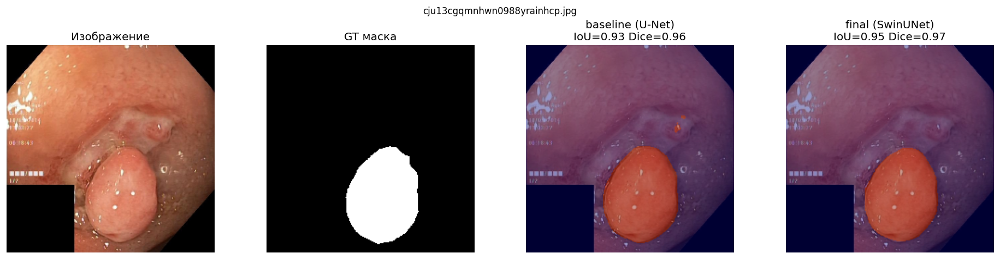
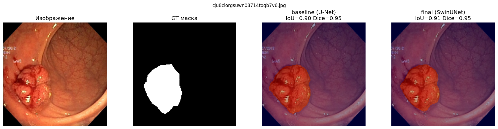

# Отчёт по итоговому проекту: сегментация полипов (Kvasir-SEG)

## 1. Паспорт проекта

- **Название проекта:** Сегментация полипов на эндоскопических изображениях (Kvasir-SEG)
- **Автор:** Фортыгин Виталий Эдуардович
- **Группа:** БФБО-01-23
- **Контакт:** @vitalikaff
- **Ссылка на репозиторий:** `<URL>`

Кратко: бинарная семантическая сегментация полипов на снимках колоноскопии. На вход - RGB-изображение, на выход - бинарная маска полипа. В проекте сравниваются две архитектуры: классический U-Net (baseline, без предобучения) и SwinUNet с предобученным энкодером Swin Transformer (финальная модель). Результат - REST-сервис на FastAPI.

---

## 2. Постановка задачи и контекст

**Предметная область.** Колоноскопия - основной скрининг рака толстой кишки. Автоматическая разметка полипов помогает врачу-эндоскописту: подсвечивает подозрительные области и снижает риск пропуска. Потенциальный пользователь сервиса - внутренний модуль клинической IT-системы или исследовательский пайплайн.

**Формулировка в терминах ML.**
- Вход: RGB-изображение колоноскопии переменного разрешения.
- Целевая переменная: бинарная маска того же разрешения (`1` - полип, `0` - фон).
- Ограничения: модель должна работать на одной картинке за разумное время (на CPU - секунды, на GPU - миллисекунды) и давать согласованную маску.

**Целевые метрики.**
- **IoU (Jaccard)** - основной показатель качества маски.
- **Dice (F1 по пикселям)** - устойчив к лёгкому дисбалансу.
- **Precision / Recall** - баланс между «лишними» и «пропущенными» пикселями.
- **Accuracy** - справочно (легко завышается из-за преобладания фона).

Эти метрики стандартны для медицинской сегментации и позволяют сравнивать с публикациями по Kvasir-SEG.

---

## 3. Данные

**Источник.** Открытый датасет [Kvasir-SEG](https://datasets.simula.no/kvasir-seg/) (Jha et al., 2020). 1000 RGB-изображений колоноскопии с бинарными масками полипов и `bbox`-разметкой.

**Структура.**
- `images/*.jpg` - RGB-изображения, разрешения от ~330×330 до ~1920×1080.
- `masks/*.jpg` - бинарные маски (после порога `>127` получаем 0/1).
- `annotated_images/*.jpg` - изображения с наложенной разметкой (используются для визуальной иллюстрации в демо).
- `train.txt` / `val.txt` - фиксированный сплит авторов (≈880/120).

**Предобработка.**
- Resize до 224×224 (под предобученный Swin).
- Нормализация: `mean=(0.5, 0.5, 0.5)`, `std=(0.5, 0.5, 0.5)`.
- На обучении - аугментации `albumentations`: `RandomRotate90`, `HorizontalFlip`, `VerticalFlip`, `Transpose`, `ShiftScaleRotate`, `RandomBrightnessContrast`, `HueSaturationValue`, `GaussianBlur`.
- Маска бинаризуется порогом `>127` и приводится к `float32`.

**EDA.** Подробно - в [`notebooks/01_eda.ipynb`](notebooks/01_eda.ipynb). Ключевые наблюдения:
- Изображения сильно разнятся по разрешению -> необходимо принудительно ресайзить.
- Распределение площади маски сильно скошено влево: чаще всего полип занимает <20% кадра, есть кадры без полипа. Это мотивирует использовать `BCE + Dice` (Dice устойчив к дисбалансу классов).

---

## 4. Модели и подходы

В проекте сравниваются две архитектуры с общим декодерным паттерном U-Net, но с принципиально разными энкодерами и режимом обучения.

### 4.1. Baseline - vanilla U-Net ([`src/models/unet.py`](src/models/unet.py))

Классический U-Net на 4 уровня даунсемплинга:

- **Энкодер:** 4 блока `Conv-BN-ReLU` + `MaxPool` каждый. Каналы 32 -> 64 -> 128 -> 256 -> 512 (bottleneck).
- **Декодер:** 4 ступени `ConvTranspose2d` + skip-connection + double conv. Каналы 512 -> 256 -> 128 -> 64 -> 32.
- **Голова:** `Conv2d(32, 1, 1)` -> логиты.
- **Инициализация:** Kaiming/PyTorch defaults, **без предобученных весов**.
- **Количество параметров:** ~7.7M.

Baseline обучается с нуля на тех же данных и с теми же аугментациями, что и финальная модель - чтобы изолировать вклад архитектуры/предобучения.

### 4.2. Финальная - SwinUNet ([`src/models/swin_unet.py`](src/models/swin_unet.py))

Гибрид Swin Transformer и U-Net:

- **Энкодер:** Swin Transformer из `timm` (`swin_small_patch4_window7_224`, `features_only=True`), извлекаем 4 уровня (`1/4, 1/8, 1/16, 1/32`). Инициализируется **предобученными на ImageNet** весами и **дообучается целиком** вместе с декодером (full fine-tuning, без заморозки).
- **Декодер:** инициализируется **с нуля**. 4 ступени апсемплинга (`ConvTranspose2d`) + конкатенация со skip-connections от энкодера + двойные свёртки.
- **Норма / активация:** `GroupNorm(8)` + `GELU` (устойчивее BatchNorm при малых батчах и работает с любым числом каналов).
- **Голова:** `Conv2d(64, 1, 1)` -> билинейный апсемплинг до 224×224.
- **Количество параметров:** ~57M.

При инференсе ImageNet-веса не качаются (`pretrained=False`) - грузится наш чекпойнт `best_swin_unet.pth` с дообученным энкодером и обученным декодером.

### 4.3. Общие условия обучения

Чтобы сравнение было честным, обе модели обучались в одних и тех же условиях ([`src/train.py`](src/train.py)):

- Loss: `BCEWithLogitsLoss + DiceLoss` ([`src/losses.py`](src/losses.py)).
- Оптимизатор: AdamW, `lr=1e-4`, `weight_decay=1e-4`.
- Шедулер: `ReduceLROnPlateau(mode='min', factor=0.5, patience=3)`.
- Эпохи: до 50, ранняя остановка по `val_loss` (сохраняется лучший чекпойнт).
- AMP (`torch.cuda.amp`) на GPU.
- Фиксированный seed=42 ([`src/train.py`](src/train.py:55) - `_set_seed`).

Эксперименты с моделями и метрики - в [`notebooks/02_baselines.ipynb`](notebooks/02_baselines.ipynb).

---

## 5. Экспериментальный протокол и результаты

**Протокол.**
- Используется фиксированный train/val-сплит авторов Kvasir-SEG (`train.txt`/`val.txt`).
- Все метрики считаются на **val-сплите** (~120 изображений) после ресайза в 224×224 и порога `0.5` по сигмоиде.
- Метрики усредняются по изображениям (per-image average), что устойчивее к выбросам, чем по пикселям всего набора.
- Скрипт оценки - [`src/evaluate.py`](src/evaluate.py), команда: `python -m src.evaluate --model all`.

**Результаты сравнения моделей.**

Численные значения получены запуском `python -m src.evaluate --model all` на фиксированном val-сплите (per-image averaging, порог 0.5):

| Модель | Архитектура | Параметров | Accuracy | Precision | Recall | F1 | IoU | Dice |
|--------|-------------|------------|----------|-----------|--------|----|----|------|
| Baseline | U-Net (без pretrain) | ~7.7M | 0.9339 | 0.8151 | 0.8302 | 0.7719 | 0.6789 | 0.7719 |
| **Final** | SwinUNet (Swin-Small + fine-tune) | ~57M | **0.9612** | **0.9085** | **0.8737** | **0.8696** | **0.7951** | **0.8696** |

Дельты (final - baseline): Accuracy **+0.0273**, Precision **+0.0934**, Recall **+0.0435**, F1 **+0.0977**, IoU **+0.1162**, Dice **+0.0977**.

Бар-чарт метрик:

Распределение per-image IoU (видно, что у SwinUNet хвост в области низких IoU заметно тоньше):

Примеры предсказаний (исходник | GT | baseline | final):

Остальные примеры и скрипт для их регенерации - в [`artifacts/figures/`](artifacts/figures/) и [`scripts/generate_artifacts.py`](scripts/generate_artifacts.py).

**Выбор финальной модели.** В качестве финальной выбран **SwinUNet**:

- **+11.6 п.п. IoU** и **+9.8 п.п. Dice** - это содержательный отрыв, а не статистический шум. SwinUNet существенно лучше формирует маску.
- Одновременно вырос и Precision (+9.3 п.п.), и Recall (+4.3 п.п.) - то есть модель и реже придумывает полипы, и реже их пропускает. Это симметричное улучшение, не сдвиг профиля ошибок.
- Главная причина выигрыша - **предобучка энкодера на ImageNet**. На 880 обучающих изображениях vanilla U-Net не успевает выучить хорошие признаки и переобучается (видно по разрыву train/val IoU ~0.74 vs ~0.68 в логах обучения). Swin Transformer стартует с богатыми универсальными признаками, fine-tune доадаптирует их под колоноскопию.
- Дополнительно Swin даёт глобальный контекст через self-attention в окнах, что полезно для полипов, форма которых читается из окружающей слизистой.

Trade-off - SwinUNet примерно в 7 раз больше U-Net по параметрам (~57M против ~7.7M) и тяжелее на инференсе. На A100 разница незначительна: эпоха обучения U-Net ~3 с, SwinUNet - порядка 10-15 с; на инференсе оба пайплайна укладываются в десятки миллисекунд на изображение. Для серверного развёртывания (одно изображение за запрос) бОльшая модель более чем оправдана. В сервисе можно переключаться между моделями через `model.active` в [`configs/config.yaml`](configs/config.yaml) или переменную окружения `POLYP_MODEL_ACTIVE`.

---

## 6. Архитектура решения и сервис

**Пайплайн.**

- Загрузка модели - единоразово, на старте приложения (FastAPI `startup` событие, [`src/service/app.py`](src/service/app.py)).
- Предобработка и инференс - в [`src/inference.py`](src/inference.py) (`preprocess_image`, `predict`).
- Какая модель используется - определяется `model.active` в [`configs/config.yaml`](configs/config.yaml). Сервис ничего не знает про конкретную архитектуру - фабрика [`src/models/__init__.py`](src/models/__init__.py) строит нужную модель по описанию из конфига.

**API.**

- `GET /health` -> `{status, model_active, architecture, encoder, description, device, image_size, threshold}`.
- `POST /predict` (multipart `file`) -> `{polyp_area_ratio, threshold, image_size, mask_png_base64, elapsed_ms}`.

**Технологический стек.** PyTorch, `timm`, Albumentations, OpenCV (headless), FastAPI, Uvicorn, Pydantic v2, Docker, pytest.

---

## 7. Наблюдаемость, конфигурация и безопасность

**Логи.** Единая настройка через [`src/logging_config.py`](src/logging_config.py). Логируются:
- запуск/готовность сервиса и выбранное устройство;
- получение каждого `/predict` запроса (имя файла, форма);
- результат предсказания (`polyp_area_ratio`, `threshold`, время инференса);
- загрузка чекпойнта.

Дополнительно для здоровья сервиса доступен `GET /health`.

**Конфигурация.** Все настраиваемые параметры вынесены в [`configs/config.yaml`](configs/config.yaml) (пути, реестр моделей, активная модель, размер входа, порог, параметры обучения, хост/порт сервиса). Переопределения через окружение - [`.env.example`](.env.example) (`POLYP_CONFIG_PATH`, `POLYP_MODEL_ACTIVE`, `POLYP_DEVICE`, `POLYP_LOG_LEVEL`).

**Безопасность.** Реальный `.env` исключён из репозитория (`.gitignore`), коммитится только `.env.example` без секретов. Чекпойнты (`*.pth`) и датасет (`data/Kvasir-SEG/`) тоже в `.gitignore`. Сам проект не содержит токенов, паролей или приватных данных пациентов: датасет - открытый.

---

## 8. Ограничения и дальнейшая работа

Ограничения:
- Фиксированный вход 224×224 ограничивает мелкие детали.
- Сервис обрабатывает изображения по одному, без батчинга.
- Нет TTA / ансамблирования.
- Нет ограничений на размер входного файла на стороне API - на проде нужен лимит.

Дальнейшая работа:
- Перейти на 384×384 / multi-scale.
- Эксперимент с заморозкой энкодера vs full fine-tune.
- Test-time augmentation и автокалибровка порога.
- Prometheus `/metrics`, structured logging (JSON), traceID на запрос.
- API-ключ + rate-limit.
- Сравнение с другими современными декодерами (UNet++/MA-Net) и loss-ом (Focal + Tversky).

---

## 9. Сценарий демонстрации на защите

1. Краткий обзор структуры проекта.
2. Запуск `python -m src.service`, демонстрация Swagger UI (`/docs`):
   - вызов `GET /health` - видна активная модель и архитектура;
   - `POST /predict` с реальным изображением из val-сплита, разбор JSON-ответа.
3. Открыть [`notebooks/02_baselines.ipynb`](notebooks/02_baselines.ipynb) - таблица сравнения U-Net vs SwinUNet и визуализация предсказаний.
4. Показать [`configs/config.yaml`](configs/config.yaml): переключение `model.active` без правки кода (`baseline` или `final`).

Внимание прошу обратить на: качество масок финальной модели, чистоту структуры `src/`, поведение сервиса (логи, `/health`), и воспроизводимость через конфиги и фиксированный seed.
